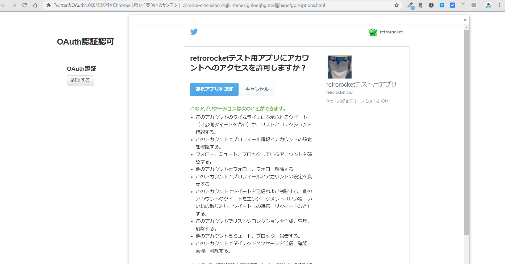
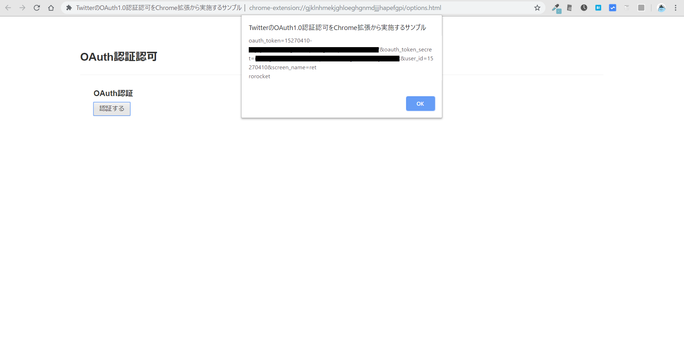

## 概要

[chrome.identity.launchWebAuthFlow](https://developer.chrome.com/apps/identity)を使用してChrome拡張からTwitterの認証認可（OAuth 1.0）を行い、Access Tokenを取得するためのサンプルです。

## 使用方法

1. `options.js`のConsumer keyの設定箇所を自分のアプリのキーに変更する。
1. 拡張機能のデベロッパーモードをオンにしてディレクトリを読み込む。
1. 拡張のIDをメモして、[Twitter Developers](https://developer.twitter.com/en/apps/)のアプリ設定で Callback URL に`https://<拡張のID>.chromiumapp.org/callback`を設定する。
1. 拡張機能のオプションページから認証を開始する。

## 必要なライブラリ

vendorディレクトリに以下のjsを追加してください。

* [johan/oauth\-js: A mirror of the svn http://oauth\.googlecode\.com/svn/code/javascript/ \(sub\-\)repository\.](https://github.com/johan/oauth-js) 
  - sha1.js
  - oauth.js

## 実行結果

認可画面

トークン取得結果

